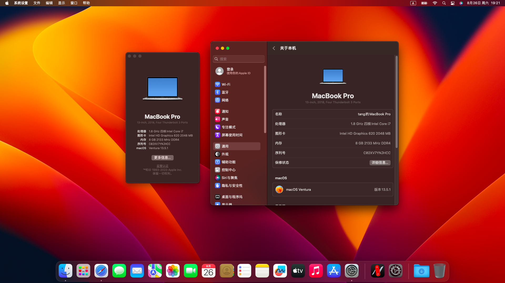

# Thinkpad-T480-Hackintosh
Lenovo ThinkPad T480 Hackintosh (macOS Monterey 12 or Ventura 13) - OpenCore 0.9.3 EFI

## 文件结构
* EFI文件夹 存放EFI文件
* imgs文件夹 存放readme.md使用的图像
* tools文件夹 存放OC config编辑工具和调整工具

## 配置
* 计算机 Thinkpad T480 20L5
* CPU I5-8250U 4c8t
* GPU Intel UHD620
* 网卡 Intel AC8265

其余配置理论上不影响引导

## 建议
EFI文件针对如上配置的T480理论可以直接使用，建议修改三码以获得更优的体验

## 驱动情况
网卡正常驱动，系统首次安装引导时即可连接Wi-Fi

核显正常驱动，支持完整的硬件加速

隔空投送无法正常使用，需更换博通网卡

## 参考
[valnoxy](https://github.com/valnoxy/t480-oc/tree/main)
